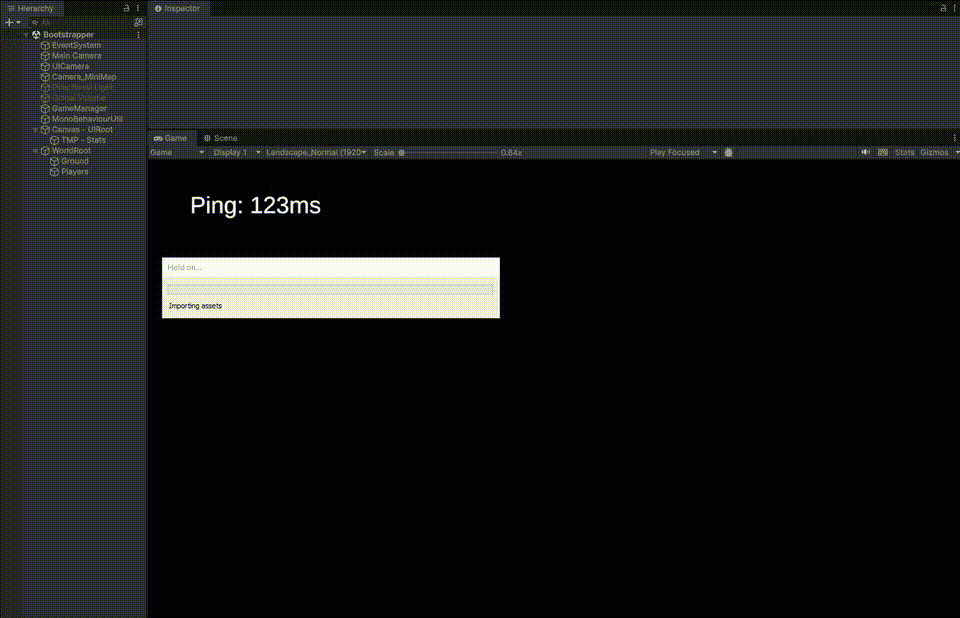
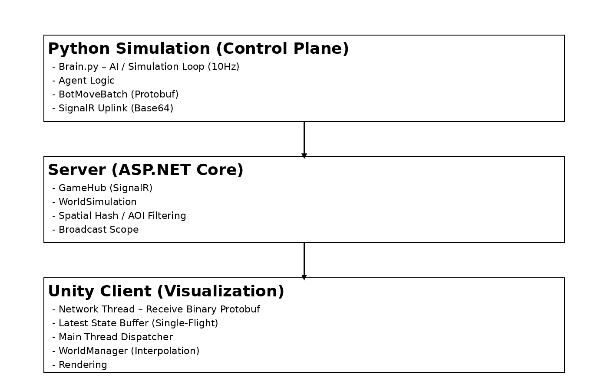
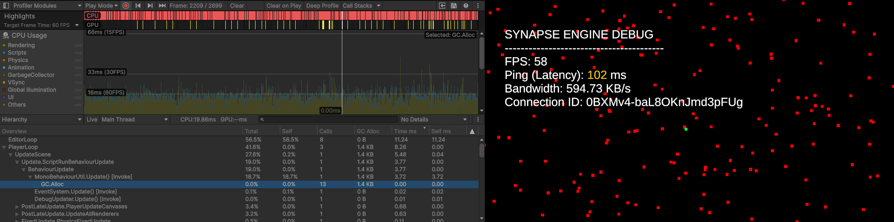
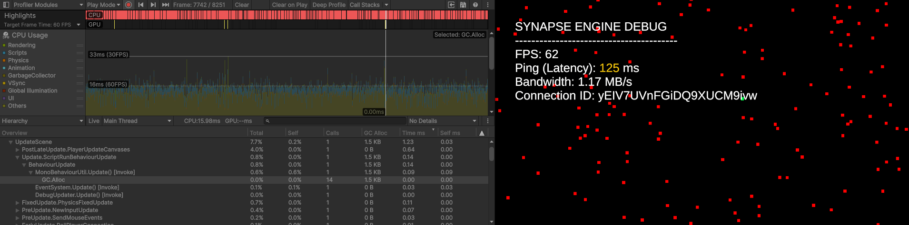

# Synapse
### A High-Performance Cross-Language Distributed Simulation Framework

> **A production-oriented engineering study for streaming thousands of Python-driven AI agents into a real-time Unity client, efficiently and predictably.**

------

## 🎥 Tech Demos

| **2,000 Agent Swarm**                                        | **High-Bandwidth Stress Test**                               |
| ------------------------------------------------------------ | ------------------------------------------------------------ |
|  |  |
| *Python-driven agents running at 10Hz, interpolated to 60Hz* | *Handling 1.2 MB/s downlink with stable FPS*                 |

------

## 🚀 Why Synapse Exists

Modern AI research and large-scale agent simulations are predominantly **Python-based**, while real-time visualization systems are typically built in **Unity**.

**Synapse explores a hard, real-world engineering problem:**

> *How can thousands of externally simulated AI agents be driven from Python and visualized in Unity in real time — without collapsing frame rate, bandwidth, or system stability?*

This project focuses on **engineering trade-offs**:

- Cross-language, real-time data streaming.
- Network-efficient large-scale agent synchronization.
- **Lock-free concurrency** and **GC optimization** in Unity.

---

## 📖 Overview

**Synapse** is a distributed simulation framework that cleanly separates:

- **Simulation & AI logic** — Python
- **Networking & aggregation** — ASP.NET Core (SignalR)
- **Rendering & interaction** — Unity, C#

The system demonstrates that:

- **2,000+ concurrent AI-controlled agents**
- Simulated externally in Python at **10Hz**
- Can be visualized in Unity at a stable **60 FPS**
- With bounded latency and predictable bandwidth usage

The project specifically targets the **“last-mile” problem** in autonomous simulation:
efficiently transmitting massive volumes of agent state data from a research environment into a real-time rendering engine.

---

## 🏗 Architecture

**Design Principles**

- Simulation must scale independently of rendering
- Network traffic must be bandwidth-predictable
- Unity client must remain GC-stable under load
- Local player experience must not degrade due to remote agent volume



---

## 🔌 Communication Model

### Hybrid Protocol Strategy

Synapse adopts a deliberate **asymmetric protocol design** optimized for real-world constraints.

- **Uplink (Python → Server):** Protobuf serialized to Base64 (for Python SignalR compatibility).
- **Downlink (Server → Unity):** Pure binary Protobuf (`byte[]`) for zero-copy deserialization.

**Core Protocol Definition (`game.proto`):**

```
message BotMoveBatch {
    repeated BotMoveData bots = 1;
}

message BotMoveData {
    string id = 1;
    Vec3 position = 2; // Compressed float representation
}
```

---

## 🔄 Synchronization Strategy

### Local Player (Client-Authoritative)

- Immediate local input application
- Asynchronous server sync
- Server excludes sender from rebroadcast

### Remote Agents (Snapshot + Interpolation)

- ~10Hz snapshots
- 60Hz interpolation (`Vector3.Lerp`)
- `0.5s` TTL prevents flicker during jitter

---

## ⚙️ Server-Side Optimization

- Spatial hashing / interest management

  Grid-based spatial partitioning (`SpatialGrid.cs`) limits broadcasts to nearby observers. O(1) grid updates

- Large packet support (1MB)

  SignalR configured with `MaximumReceiveMessageSize = 1MB` to safely handle aggregated Python batches.

---

## 📊 Performance Metrics

Observed on **Intel i7 / RTX 3070 / Localhost**

| Metric      | Value         | Context                      |
| ----------- | ------------- | ---------------------------- |
| Agent Count | **2,000+**    | Python-driven entities       |
| Tick Rate   | **10 Hz**     | Simulation / network updates |
| Frame Rate  | **60 FPS**    | Unity rendering              |
| Bandwidth   | **~1.2 MB/s** | Peak downlink                |
| Latency     | **30–100 ms** | Under heavy TCP load         |

### Client Optimization (Zero-Allocation Framework, Protocol-Level Allocations Isolated)

To ensure stability under high load, the Unity client employs strict **Object Pooling** and **Lock-Free Concurrency** patterns.

1. **State Conflation & Batching**: Instead of queuing every network packet (which causes main-thread choking), the network thread uses `Interlocked.CompareExchange` to perform **single-flight scheduling**. Only the *latest* WorldState is processed, discarding stale data immediately.
2. **Thread Safety**: Uses `Volatile.Read/Write` and `Interlocked` operations for bandwidth statistics and state synchronization, avoiding heavy `lock` contention.
3. **Generic Context Pooling**: Custom task dispatcher uses a generic object pool (`ContextAction<T>`) to eliminate closure allocations when bridging background threads to the main Unity thread.





Unity Profiler showing a small, stable GC allocation (~1.4KB per network update), originating exclusively from Protobuf deserialization of incoming payloads (business data). 

All framework-level infrastructure (dispatching, pooling, scheduling) runs with zero per-frame allocations.

---

## 🧠 Engineering Trade-offs

### Base64 Overhead

- **Cost:** ~33% uplink size increase
- **Benefit:** Compatibility and stability with Python SignalR clients
- **Net Result:** Still ~80% smaller than equivalent JSON payloads

### Transport Choice

- TCP/WebSocket chosen for reliability and simplicity
- At extreme scale (>5,000 agents), TCP Head-of-Line blocking becomes visible

------

## 🧹 Unity Client Optimization

- **Zero-Allocation Hot Paths**
- **Object Pooling** via `PoolService` (no Instantiate/Destroy churn)
- **EventBus** for type-safe, decoupled communication
- Stable frame time under sustained load

------

## 📂 Project Structure

- **Synapse.Server**
   ASP.NET Core 8.0 SignalR server, authoritative world state
- **Synapse.AI**
   Python 3.10 AI swarm controller (random-walk agents with bounds)
- **Synapse.Client**
   Unity 6000.3.1f1 LTS visualization client
- **Synapse.Shared**
   Shared `.proto` definitions for C# and Python

---

## ⚠️ Limitations & Roadmap

- TCP HoL blocking at extreme scale

  Potential upgrade: KCP / ENet / RUDP

- Client-authoritative security model

  Potential upgrade: server-authoritative with prediction & reconciliation

- Base64 uplink overhead

  Potential upgrade: native binary transport to remove Base64 overhead

---

## ▶️ Setup & Run

1. **(Optional) Regenerate Protobuf**

   ```
   python -m grpc_tools.protoc -I. --python_out=. --pyi_out=. game.proto
   ```

2. **Start Server**

   ```
   cd Synapse.Server
   dotnet run
   ```

3. **Start Unity Client**

   - Open `Synapse.Client`
   - Open the **Bootstrapper** scene
   - Press Play

4. **Launch AI Swarm**

   ```
   cd Synapse.AI
   pip install -r requirements.txt
   python brain.py
   ```

------

## 🎯 Intended Audience

This project is most relevant for:

- Senior / Staff Unity Engineers
- Gameplay, Simulation, or Network Engineers
- Engineers working on AI-driven worlds or agent-based systems
- Teams exploring Python ↔ Engine real-time integration

**Synapse is not a drop-in networking library** — it is a reference architecture and engineering study.

------

*Project developed as a real-world feasibility study for high-performance distributed simulation - and yes, it was genuinely fun to build.*

*Enjoy*

